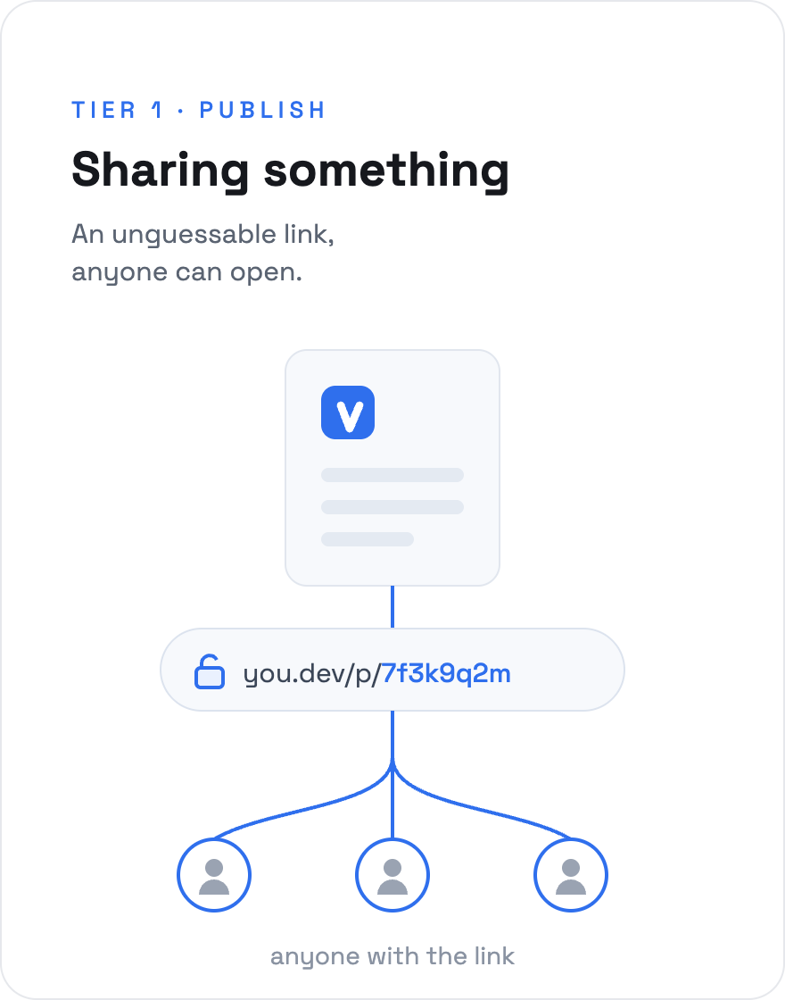
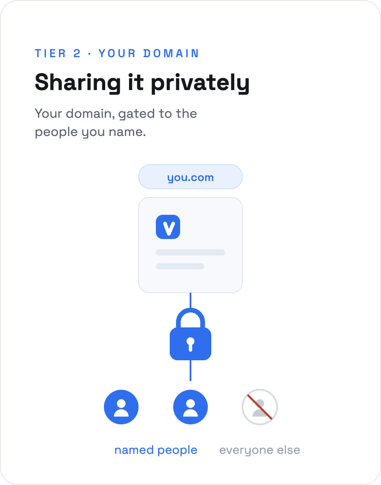
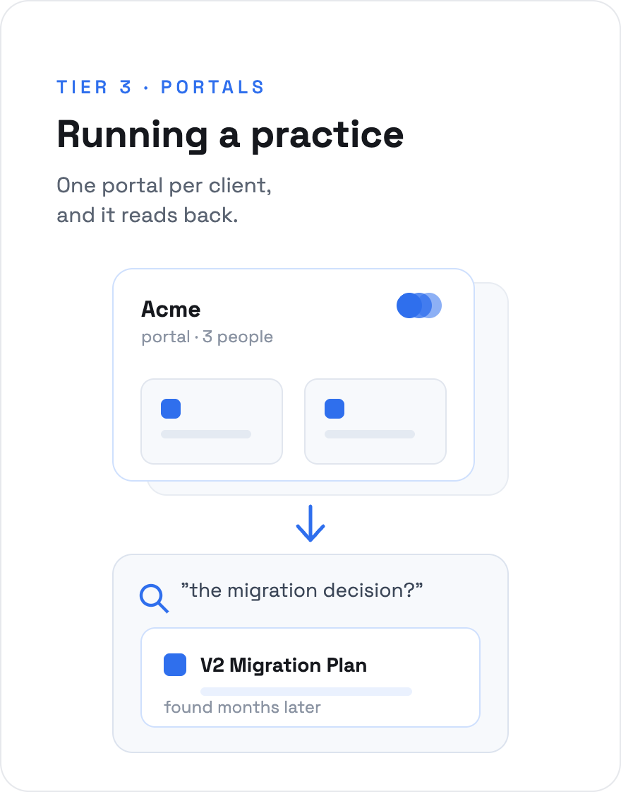

<p align="center">
  
</p>

# PageVault

**Publish an HTML or Markdown artifact to a URL, and decide who can open it** — straight
from Claude, ChatGPT, Gemini, Copilot, or any MCP-capable tool, without leaving the chat
where you made it. Self-hosted on Cloudflare's free tier. Whoever you send it to installs
nothing and signs up for nothing — no account, on any platform.

<p align="center">
  <a href="#1--sharing-something"></a>
  &nbsp;
  <a href="#2--sharing-it-privately"></a>
  &nbsp;
  <a href="#3--running-a-practice"></a>
</p>

 &nbsp;
 &nbsp;


> **Pre-1.0 and honest about it.** [Status](#status) says what works today and what
> doesn't. This README is the setup guide — the product argument lives on the
> [product page](https://danjamk.github.io/pagevault).

---

## Is this for you?

Three ways people run PageVault. Pick the one that sounds like you — the setup
sections below follow the same order, and each is a superset of the one above it.

| | You are | You get | It costs |
|---|---|---|---|
| **1** | **Sharing something** — you made a report in a chat and need to hand it to someone | Deploy, publish, share unguessable `/p/` links that anyone can open | free · **no card** |
| **2** | **Sharing it privately** — your own work, your own domain, only named people | The same, on `you.com`, with documents gated to specific email addresses | a domain · **a card on file** |
| **3** | **Running a practice** — a consultant or solo operator with recurring clients | Per-client portals, permissions on the client not the document, and an agent that can search the collection back | same as 2 |

Two honest notes on that table:

- **The real jump is 1 → 2, not 2 → 3.** Private sharing needs Cloudflare Zero
  Trust, and Cloudflare wants a card on file before it will turn that on — even
  though the free plan is free and you won't be billed. That's the seam, and
  pretending otherwise would waste your time. Portals, on top of it, are just a
  data model.
- **Under ~5 clients, tier 3 is probably not worth it.** A shared folder per client
  is genuinely simpler. Portals earn their keep once the artifacts pile up.

You can start at 1 and climb later. Every rung is additive, your documents carry
across untouched, and rungs 1–2 undo cleanly.

---

## 1 · Sharing something

Public links, `workers.dev`, no domain, no Zero Trust, no card. ~10 minutes.

**You need:** a [Cloudflare account](https://dash.cloudflare.com/sign-up) ·
Node 22+ · a Cloudflare API token.
Full detail in [`docs/setup/prerequisites.md`](docs/setup/prerequisites.md).

### Create your Cloudflare API token

Either path below reaches your account with an API token — explicit, so a deploy can
never land in the wrong account. Create it once, with room to climb.

**[Cloudflare → API Tokens](https://dash.cloudflare.com/profile/api-tokens)** →
*Create Custom Token*, name it `pagevault`. Grant **all** of these now, so climbing
the ladder never means re-scoping:

| Type | Permission | Access | Needed for |
|---|---|---|---|
| Account | Workers Scripts | Edit | tier 1 · deploy |
| Account | Workers KV Storage | Edit | tier 1 · documents |
| Account | Account Settings | Read | tier 1 · identify the account |
| Zone | Workers Routes | Edit | tier 2 · custom domain |
| Zone | DNS | Edit | tier 2 · the domain record |
| Account | Access: Apps and Policies | Edit | tier 2 · gated access |
| Account | Access: Organizations, Identity Providers, and Groups | Edit | tier 2 · **the viewer group lives here — easy to miss** |

### Install and deploy

```bash
npm install -g pagevault
pagevault init          # pastes your token, picks a tier, provisions and deploys — no clone
```

`pagevault init` walks you through the token, the tier, and your account, then ships
the Worker to Cloudflare and remembers where it landed in `~/.pagevault/`. Later,
`pagevault upgrade` redeploys after `npm update -g pagevault`. Nothing is cloned;
the package carries the Worker.

<sub>**Prefer to run from source** — to read the code, or contribute? `git clone`, then
`make setup && make preflight && make deploy && make verify` does the same, from the
repo. That path is the one every rung below is also tested on.</sub>

### Publish something

```bash
pagevault login --url https://<your-worker>.workers.dev --token <PAGEVAULT_API_TOKEN>
pagevault publish report.html --public
```

`init` prints both values when it finishes. Or publish straight from the conversation
where you made the artifact — see [Connect an agent](#connect-an-agent).

`/v/` and `/admin` fail closed at this tier. That's correct: you aren't using them
yet. When you want them, climb.

---

## 2 · Sharing it privately

Your own domain, and documents that only named people can open. They get a
six-digit code by email — no account, no password, nothing installed.

**Adds:** a domain [in the same Cloudflare account](docs/setup/prerequisites.md#a-domain-in-the-same-cloudflare-account)
· Cloudflare Zero Trust enabled (**a card on file; nothing is charged**) · a second,
narrow runtime token.

The domain and the gating are separate upgrades. You can put PageVault on your own
domain without turning on Zero Trust at all. Re-run the setup to climb a rung — it
shows your current choices and asks only for what the new rung needs:

```bash
pagevault init          # re-run: pick tier 2, give it your hostname, redeploy
```

Once Access is on:

```bash
pagevault publish report.html --emails cfo@acme.com,ceo@acme.com
```

That grant is **additive** — it can admit a viewer, never silently revoke one — and
it invents no portal for two people.

### The two tokens, and why

The runtime token lives *inside* the Worker as its `CF_API_TOKEN` secret and keeps
the viewer group in sync as you add and remove people. It is scoped to a single
permission on purpose: a compromised Worker can edit one Access group and nothing
else — never your KV, never your other Workers.
See [ADR-002](docs/adr/ADR-002-seat-bounding.md).

---

## 3 · Running a practice

Permissions move from the document to the **client**. A portal is one durable URL
per client; every artifact lands there, gated to their people. Adding someone to a
client's team is one write, not fourteen.

```bash
pagevault publish q3-review.html --portal acme
pagevault share acme cfo@acme.com
pagevault search acme "migration decision"
```

And the collection reads back. The MCP server exposes `search_portal` and
`read_document`, so six months in, *"what did we decide about the migration?"* is a
question the portal can answer — over the same connection you published through.
Publishing and remembering become the same act.

Portals are invisible until you ask for them. Nothing above this section required
knowing what one is.

### Connect an agent

The MCP server runs inside your Worker — there is nothing extra to host.

Add your Worker as a connector on claude.ai, Desktop, or mobile — OAuth 2.1, and you
sign in with your own Access identity. Claude Code uses a bearer token. Same server,
same twelve tools, every surface.

Tools carry annotations, so a host knows which are safe to auto-run and which need a
confirmation first. Full walkthrough:
[`docs/setup/connect-mcp.md`](docs/setup/connect-mcp.md).

---

## Status

Pre-1.0. `1.0.0` is reserved for "a stranger can rely on this."

**Working today**

- **`npm install -g pagevault && pagevault init`** — provision and deploy your own
  PageVault with no clone; `pagevault upgrade` redeploys later. The package ships the
  Worker itself ([ADR-014](docs/adr/ADR-014-installed-product-not-thin-client.md))
- Publish HTML and Markdown; both render, and the original source reads back
- Three visibility modes: owner-only · email-gated · unguessable public link
- Per-client portals, with permissions on the portal
- Owner console (light and dark), CLI, and remote MCP server — the CLI and MCP
  server are held at feature parity with each other
- MCP over OAuth 2.1 from claude.ai, Desktop and mobile; bearer from Claude Code
- Every artifact renders in a sandboxed iframe; `allow-same-origin` is banned by a
  test that fails the build ([ADR-007](docs/adr/ADR-007-viewer-shell.md))
- Idempotent provisioning with a real teardown — `make destroy` puts the account back

**Not yet**

- **PDF export and raw download** ([#50](../../issues/50), [#49](../../issues/49)) — a
  long infographic as one continuous page, no pagination cutting a chart in half
- **Full-system export** ([#35](../../issues/35)) — backup works; a restore round-trip doesn't
- **Browser upload** ([#6](../../issues/6)) — publishing is CLI/MCP only
- **Read receipts, expiry, email-on-publish, portal branding** — designed, not built

---

## How it compares

The honest version, including the rows where the alternatives win. The
[full field guide](#) <!-- TODO(#60) --> puts ten tools across six capability
groups on an interactive map — and it's served through PageVault, so it doubles as
a live sample.

### Use something else if…

| If you need | Go to |
|---|---|
| Comments, reactions, live collaboration on the document | [`jonesphillip/sharehtml`](https://github.com/jonesphillip/sharehtml) — same Cloudflare design, plus collaboration. PageVault has none of it, on purpose. |
| The host to never see your plaintext | An end-to-end-encrypted tool. PageVault's Worker can read what it serves; that's an honestly weaker guarantee. |
| Per-viewer watermarks, an NDA gate, a named audit trail | A deal-room product. PageVault logs access decisions but has no per-view receipts. |
| CRM, invoicing, e-sign around the client relationship | A client-portal SaaS. A much larger product; PageVault is deliberately none of it. |
| One link, right now, zero setup | Claude's own Publish button, or any quick link-sharer. |
| Fewer than ~5 clients | A shared folder per client. Said plainly because it's true. |

### The short table

One representative per category, not ten names.

| | PageVault | sharehtml | Link tool | Portal SaaS |
|---|:---:|:---:|:---:|:---:|
| **Per-client collection** — the unit is the client, not the link | ✅ | ❌ | ❌ | ✅ |
| **Agent read-back** — search the collection back, months later | ✅ | ❌ | ❌ | ~ rare |
| **Publish from a chat** (MCP) | ✅ | ❌ | ~ some | ❌ |
| **Renders HTML *and* Markdown**, hands the source back | ✅ | ~ HTML | ~ | ❌ file host |
| **Free, self-hosted, your own domain** | ✅ | ✅ | ❌ | ❌ |
| **Privacy** — can the host read it? | reads it | reads it | varies | reads it |
| **Collaboration** — comments, presence | ❌ | ✅ | ❌ | ✅ |
| **Accountability** — per-view receipts, watermarks | ❌ | ❌ | ~ opens | ✅ |

No single row is unique. Plenty of tools render HTML, several publish from a chat,
and portal suites have held collections for years. What's rare is the
**combination**: free, self-hosted, renders the artifact, holds the collection, and
lets an agent read it back. That's the claim — not any one row.

---

## Docs

| I want to… | Start here |
|---|---|
| Understand the design | [`docs/architecture.md`](docs/architecture.md), then the [ADRs](docs/adr/) |
| Work through setup properly | [`docs/setup/prerequisites.md`](docs/setup/prerequisites.md) |
| Connect Claude to it | [`docs/setup/connect-mcp.md`](docs/setup/connect-mcp.md) |
| Back it up | [`docs/setup/backup-and-restore.md`](docs/setup/backup-and-restore.md) |
| See how it was built with an agent | [`docs/engineering/how-i-built-this.md`](docs/engineering/how-i-built-this.md) |
| Contribute | [`CONTRIBUTING.md`](CONTRIBUTING.md) |

Everything is indexed in [`docs/README.md`](docs/README.md).
Release history: [`CHANGELOG.md`](CHANGELOG.md).

---

<sub>MIT · built by [@danjamk](https://github.com/danjamk) · PageVault owes
[`jonesphillip/sharehtml`](https://github.com/jonesphillip/sharehtml) three ideas —
the Access-provisioning script, the capability-token model, and the sandboxed
iframe. They got there first.</sub>
