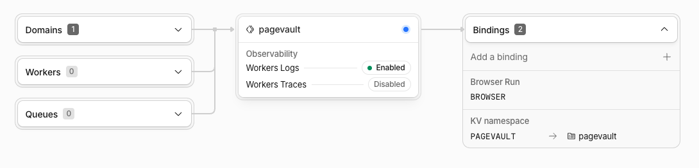

# PageVault — Architecture

The design, and why it is the way it is. Every Cloudflare and MCP behavior asserted
here was verified against current documentation. The contested decisions have their
own ADRs in `docs/adr/`; read the relevant one before overturning it.

> **Revised 2026-07-28.** The original design published one document and returned one
> link. That primitive is table stakes — six commercial products and
> [`jonesphillip/sharehtml`](https://github.com/jonesphillip/sharehtml) (Apache-2.0,
> a Cloudflare PM's project) already do it, several of them better. **The collection
> is the product.** See ADR-005.
>
> PageVault owes sharehtml three ideas: the Access-provisioning setup script, the
> capability-token model, and the sandboxed iframe. They are credited in the README
> because they got there first and pretending otherwise would be both wrong and easy
> to catch.

---

## 1. The idea

**Cloudflare Access answers "who are you?". The Worker answers "may you see this?".**

That split is the architecture, and the Worker's half lives in **exactly one
function** — `canView()`. One Access application per surface, configured once.
Permissions live in KV, on the **portal**, not scattered across documents.

The unit is not the link. The unit is the client.

> Over a nine-month engagement you produce fourteen artifacts for one client.
> Fourteen links, fourteen emails, and a client digging through Gmail in March for
> the architecture doc you sent in January.

One durable URL per client. Every artifact lands there — tagged, dated, gated to
their people. Add someone to the client's team: **one write, not fourteen.**

And the collection reads back. The MCP server exposes `read_document` and
`search_portal`, so six months in, *"what did we decide about CDC on V2?"* is
answerable from the portal. **Publishing and remembering become the same act.** That
is what makes a portal worth having at one client, which is the number that exists
today.

### Why the whole thing is Cloudflare

PageVault is not a web app that happens to be hosted on Cloudflare. It is **one Worker
plus five Cloudflare primitives**, and the choice of each is load-bearing enough that
swapping one would change the product.

| Primitive | What it does here | Why it, specifically |
|---|---|---|
| **Workers** | The whole product. Router, authorization, viewer shell, console, MCP server. | On a custom domain the Worker *is* the origin — there is no server behind it to bypass, which is also why a quota fail-open cannot serve an unauthorized document (§12). |
| **Workers KV** | Every document, portal, member list and public token. | Key **metadata** is the trick: a portal index renders from one `list()` with zero reads. A database would be a second thing to run, back up, and pay for. |
| **Cloudflare Access** (Zero Trust) | Answers *who are you* on `/v` and `/admin`. One-time PIN, so a client needs no account anywhere. | The alternative is building password auth, email delivery and session management — and asking a client's CFO to make an account, which is the one thing this product says you shouldn't have to do. |
| **Browser Rendering** | Single-page PDF export. | Headless Chrome without hosting headless Chrome. Optional: delete the binding and the feature degrades off. |
| **Analytics Engine** | View records — who opened what, when (§12). | It has a **separate write quota** from KV: 100k/day against KV's 1,000. A view counter in KV would put reading in competition with publishing and lose. |

Two bindings are optional by design — `BROWSER` and `ANALYTICS`. Remove either and the
Worker keeps running with that feature quietly off. A second KV namespace, `OAUTH_KV`,
belongs entirely to the OAuth provider and never mixes with ours.

**The economics are the point.** All of it fits the free tier: 100,000 requests a day,
100,000 KV reads, 100,000 Analytics writes, and 50 Zero Trust seats. The binding
constraint is KV **writes** — 1,000 a day, and a publish costs two or three. Reading is
effectively free; writing is the thing to count.

**And the honest cost:** Cloudflare wants a card on file before it will enable Zero
Trust, even on the free plan where nothing is charged. That is the one place this stops
being free-as-in-no-signup, and it is why the tiers split where they do (§9).

### The stack, and what is deliberately not in it

**TypeScript throughout**, on Node 22 — Wrangler 4 requires it. Tests are `vitest` with
`@cloudflare/vitest-pool-workers`, so the Worker suite runs inside the real Workers
runtime rather than a Node approximation of it; the CLI and setup scripts use the
built-in `node --test`. Package manager is `pnpm`.

Four choices are worth stating because they are decisions, not defaults:

- **No frontend framework, anywhere.** The owner console is server-rendered HTML with
  vanilla JavaScript and no build step ([ADR-004](adr/ADR-004-console-auth.md)). A
  framework would add a build pipeline, a bundle to audit, and a second security surface
  on the one page that can administer everything — to render what is essentially a list.
- **No database.** KV is the whole persistence layer. Nothing to provision, back up
  separately, or pay for, and the free tier covers it. The cost is real: no transactions,
  no queries, and ~60s eventual consistency that the code has to assume everywhere.
- **The CLI has zero runtime dependencies.** Node built-ins only. It is the thing that
  asks for your Cloudflare API token, so its supply chain is exactly as large as Node
  itself — a property worth more than any convenience library.
- **The Worker's dependencies are few and each has a reason**: `jose` for JWT
  verification (never hand-roll that), the `agents` SDK and the MCP SDK for the remote
  MCP server, `zod` for tool schemas, `markdown-it` plus KaTeX for Markdown rendering,
  `@cloudflare/puppeteer` for PDF export, and Cloudflare's OAuth provider. Adding to that
  list is a conversation, not a commit — prime directive #7.

`nodejs_compat` is on, because the `agents` SDK reaches for `node:path` through
transitive dependencies. That flag is not optional and not discoverable from tests: the
suite passes without it and `wrangler` refuses to build.

## 2. Simplicity first — portals are invisible until needed

Non-negotiable. The quickstart does not contain the word "portal":

```bash
pagevault publish report.html                    # private, just you
pagevault publish report.html --emails a@x.com   # email-gated, this doc only
pagevault publish report.html --public           # unguessable link
```

`init` creates a `default` private portal. Every document has one; the user does not
have to know that yet. `--portal` is required **only when ambiguous** — two or more
portals exist and no default is set. Portals appear later, in a section called *"when
you have the same audience over and over."*

**Every publish prints where it landed.** That is the actual safeguard against
misfiling a client report, not a required flag:

```
→ https://share.example.com/v/realplus/k3x9mq2vb7pd
  portal: realplus · visible to: 3 members
```

## 3. Routes and Access topology

| Route | Access app | Worker does |
|---|---|---|
| `/` | none | **Secured:** 302 → `/admin`. **Public:** a quiet landing page — there is no console to redirect to, and `/admin` would be a dead Forbidden. Keys on `CF_ACCESS_AUD_ADMIN`. |
| `/health` | none | Unauthenticated liveness: name, `<version>+<sha>`, deploy time. |
| `/v/{slug}` | **App A** (`host/v`) | Portal index. `canView` per doc. |
| `/v/{slug}/{id}` | **App A** | Viewer shell. `canView`, then mint a capability token. |
| `/render/{id}?cap=` | none | **Artifact bytes.** Capability token only. Framed, never navigated. |
| `/p/{token}` | none | Capability link → shell. No auth, no seat burned. |
| `/pub/{slug}`, `/pub/{slug}/{id}` | none | Public portal → shell. No auth, no seat burned. |
| `/api/*` | none | Bearer token. |
| `/mcp` | none | **Remote MCP**, Streamable HTTP. Bearer token. See ADR-006. |
| `/admin`, `/admin/*` | **App B** (`host/admin`) | Owner console. |

**Two Access applications. Zero bypass policies.** Paths belong to the *application*,
not the policy — a bypass policy scoped to `/api/*` is not expressible, and a
path-less app swallows the whole host. Uncovered paths reach the Worker with no JWT
at all, which is better than a bypass policy: fewer knobs, nothing to misconfigure.
See ADR-001.

`CF_ACCESS_AUD` is **two vars, not one**. `/v` accepts only App A's audience;
`/admin` only App B's. A shared AUD would let any portal member present their token
to the owner console — a privilege escalation that looks like a config
simplification.

> 🔴 **`/mcp` must never sit behind Access.** Anthropic's connector infrastructure
> calls it from their cloud (`160.79.104.0/21`) — no browser, no cookie, no way to
> complete an OTP login. Access would hard-block it. The Worker does its own auth
> there, which is what it does everywhere.

## 4. Data model (Workers KV)

```
portal:{slug}     → JSON Portal        [+ KV key metadata]
members:{slug}    → JSON string[]      (normalized, lowercase)
idx:{slug}:{id}   → ""                 (existence = membership; no RMW race)
doc:{id}          → string (the served bytes: HTML, or markdown rendered to HTML)
raw:{id}          → string (markdown only: the original .md, for download + read-back)
meta:{id}         → JSON DocMeta       [+ KV key metadata]
pub:{token}       → string (doc id)
moved:{old id}    → string (doc id)    (a renamed document's forwarding address; 1-year TTL)
```

**The prefixes are disjoint on purpose.** The obvious layout — `portal:{slug}:members` —
collides with `list({ prefix: "portal:" })`: the member list comes back looking like a
portal. Members and the index get their own namespaces instead. There is a test for it.

**There is a second KV namespace, `OAUTH_KV`, and nothing above lives in it.** It belongs
entirely to `@cloudflare/workers-oauth-provider` — issued tokens, grants, and registered
clients for the MCP OAuth flow (§11). Keeping it separate means a library's key space can
never collide with ours, and a `list()` over our prefixes can never return one of its
records. It is provisioned alongside `PAGEVAULT` and otherwise never touched by our code.

```ts
type PortalKind = "private" | "restricted" | "public";
type SourceKind = "html" | "markdown";   // markdown is rendered to HTML at publish time; raw kept in raw:{id}

interface Portal {
  slug: string;          // ^[a-z0-9][a-z0-9-]{0,38}[a-z0-9]$, reserved words rejected
  name: string;
  kind: PortalKind;
  description?: string;
  createdAt: string;
  updatedAt: string;
}

interface DocMeta {
  id: string;
  portal: string;        // always set; defaults to "default"
  name: string;          // the FILENAME — the document's identity within a portal (ADR-017).
                         // Same (portal, name) → same id → overwrite in place. Title is display-only.
  title: string;
  summary?: string;      // one line, shown in the portal index
  sourceKind: SourceKind;
  ownerOnly: boolean;    // a draft the client cannot see. Beats every grant below.
  extraEmails?: string[];// ADDITIVE grant, this doc only. Never subtractive.
  publicToken?: string;  // explicit widening, separate route
  tags?: string[];
  createdAt: string;
  updatedAt: string;
  bytes: number;
}
```

**Listing** is `list({ prefix: "idx:{slug}:" })` for membership, and
`list({ prefix: "meta:" })` with **KV key metadata** for titles and dates. Never a
read per document — an N+1 passes every functional test and silently eats the
100k/day read quota. There is a test asserting one `list()` and zero `get()`s.

`emails` stay **out** of key metadata: KV caps it at 1024 bytes and an allowlist can
blow it, which would break listing for exactly the documents with the most sharing.

**No index array.** It is a read-modify-write on every publish and it corrupts itself
the first time two publishes race.

**KV is eventually consistent** (~60s), with no read-after-write guarantee even at
the same edge. The CLI retries before printing a URL. Nothing may depend on one.

**Renaming moves a document, and leaves a tombstone.** The id hashes the filename, so a new
filename is a new id — there is no way to change one and keep the other. `editDocument` writes
the complete new document before deleting the old keys (a crash leaves *both*, never neither),
repoints `pub:{token}` so the `/p/` link the client already holds survives untouched, and writes
`moved:{old id}`. The `/v/` and `/pub/` routes read `meta:{id}` **first** and consult the
tombstone only on a miss — which is what makes it self-healing, since a later publish under the
reclaimed filename lands on that same id and shadows it with no cleanup write. The redirect is
issued only after the target passes the same portal check and `canView` the document itself would
have faced. Editing only the title, summary, tags — or only the *case* of the filename — is one
write at the same id. See [ADR-020](adr/ADR-020-rename-leaves-a-forwarding-address.md), which is
also where the "why not stable GUIDs like Google Drive" argument lives.

## 5. Authorization — one function, no exceptions

Pure by design — no `env`, no KV, no I/O. Everything it needs is an argument, so the
whole matrix is exercised without a Worker, and routes come after it rather than
alongside it.

```ts
export function canView(
  doc: DocMeta, portal: Portal, members: string[],
  email: string | null, ownerEmail: string,
): boolean {
  if (emailsMatch(email, ownerEmail)) return true;

  // ownerOnly beats EVERY grant below. Evaluated first, deliberately.
  if (doc.ownerOnly) return false;

  if (portal.kind === "public") return true;
  if (email === null) return false;

  // Additive per-document grant. Can only ever ADD a viewer — never remove one.
  if (doc.extraEmails?.includes(email)) return true;

  if (portal.kind === "restricted") return members.includes(email);
  return false;   // private portal, and we already know they are not the owner
}
```

Invariants, each of which is a test:

1. A document **never** inherits more visibility than its portal. It widens only by
   two explicit owner acts: `extraEmails`, or a minted `publicToken` on a separate
   route that does not consult `canView` at all.
2. `extraEmails` is **additive, never subtractive** — visible in the shape of the
   code as an early `return true`, never a `return false`.
3. **`ownerOnly` beats everything**, evaluated before any grant. A draft with an
   email grant on it stays invisible. Check `extraEmails` first and you silently leak
   drafts while every other test still passes.
4. **Cross-portal isolation is absolute.** Membership in portal A confers nothing in
   portal B. This is the threat that ends a consulting business, not a feature. Write
   that test first.
5. `email === null` can only ever reach `public` portals and valid `/p/` tokens.

**`canViewPortal()` is a separate function, and that is what keeps the index free.**
`extraEmails` is a *document* grant, not a portal grant — someone you sent one report to
can open that report and has no business seeing the client's whole index. So the index
never consults `extraEmails`, which means it renders from KV key metadata with **zero
reads**. Fold the two together for elegance and every portal page load becomes an N+1.

Read-side MCP tools go through the **same function**. A token scoped to portal A must
not be able to `search_portal("clientB")` — that is the same threat wearing a
read-only disguise, and it is the version most likely to be gotten wrong because it
feels like a convenience feature.

## 6. Identity — verify, never trust

Access injects `Cf-Access-Jwt-Assertion` and strips it from external requests. That
is a *deployment* property, not a *code* property. One misrouted Worker, one
`workers.dev` subdomain left enabled, and a trusted-header design is a full
authentication bypass with no error and no log.

- Verify the signature with `jose` + `createRemoteJWKSet`. RS256. Access rotates
  signing keys ~every 6 weeks; match on `kid`, never pin.
- Pin **both** `issuer` and `audience`. Either alone is insufficient.
- Missing config → **deny**. Fail closed.
- Never read `Cf-Access-Authenticated-User-Email`.
- **Normalize every email at every boundary.** A case-mismatched email failing an
  allowlist check is a confidentiality bug that looks like a UI bug.

The dev bypass is `AUTH_MODE === "none"` — **exact string equality**, never a
truthiness test, and additionally refused unless the request host is localhost. A
truthiness check here is an authentication bypass one typo away.

## 7. Hostile artifact JS

The premise of this product is *hosting untrusted code on a trusted origin*. The HTML
is LLM-generated, it runs JavaScript, and it may have been built from content the
model did not control. On the same origin as the console and the API, with the
viewer's `CF_Authorization` cookie riding along automatically, that is an open door.

**The artifact never renders in our origin's document context.**

1. `/v/{slug}/{id}` returns a **trusted shell** — our HTML, our JS, nothing from the
   artifact.
2. The shell frames the artifact: `<iframe sandbox="allow-scripts">`, **no
   `allow-same-origin`**. That combination gives the frame a unique opaque origin:
   scripts run, but it cannot read our cookies, cannot touch our DOM, and cannot make
   credentialed same-origin requests.
3. The shell holds a **short-lived HMAC capability token** scoped to that one
   document. The iframe never receives one and cannot forge one.
4. Privileged browser endpoints require the capability **and** an `Origin` check that
   **rejects `Origin: null`** — which is precisely what a sandboxed iframe's origin
   is.

`/render/{id}` serves artifact bytes with a strict CSP *and* the `sandbox` directive,
so even a direct top-level navigation lands in an opaque origin. That is one better
than sharehtml, which relies on the iframe attribute alone.

> ⚠️ `sandbox="allow-scripts allow-same-origin"` is **functionally no sandbox at
> all** — the frame can reach back into the parent and strip the attribute. It is
> exactly the mistake made at 11pm because an artifact "needs" it. It doesn't. There
> is a lint-level test asserting the string `allow-same-origin` appears **nowhere** in
> the codebase.

**The shell is also the only thing PageVault puts on a client's screen for its own
benefit.** One muted line at the end of the chrome — "Powered by PageVault", linking to
the product page — never a logo and never above the client's own title. A consultant's
deliverable should not look like it came from a template. `PAGEVAULT_BRANDING=off`
removes it entirely, and the default is deliberately inverted from `AUTH_MODE`'s: a
missing or blank value shows the mark, because the failure that matters here is silently
stripping attribution from a deployment that never asked to, not the reverse.

**Public does not mean unsandboxed.** `/p/*` and `/pub/*` go through the same shell.
A public artifact is *more* exposed, not less. `X-Robots-Tag: noindex, nofollow` on
both.

## 8. Credentials

| Credential | Where | Verified how |
|---|---|---|
| Access JWT | `Cf-Access-Jwt-Assertion`, on `/v` and `/admin` only | JWKS, `kid`, `iss` + `aud` |
| `PAGEVAULT_API_TOKEN` | bearer, on `/api/*` and `/mcp` | constant-time compare |
| Capability token | header, from the shell to privileged endpoints | HMAC, ~10 min, scoped to one doc |
| Console session token | bearer, minted into `/admin` | HMAC, ~15 min |

**No cookie is ever trusted, anywhere.** The browser attaches `CF_Authorization` to
`/api/*` whether we want it or not — it is scoped `Path=/` on the hostname — and
honouring it would make every state-changing endpoint CSRF-reachable from a document
we serve. See ADR-004.

**The API token never touches the browser.** Not in the page, not in `localStorage`,
not in a data attribute.

## 9. Deploying — what is true, verified on a real account

### Two tiers, three rungs

The operator sees **two tiers** and never the word "rung" ([ADR-018](adr/ADR-018-public-and-secured-tiers.md)):

| Tier | What it is | Internally |
|---|---|---|
| **Public** | `/p/` links anyone holding the URL can open. Your own domain is a prompt *inside* Public, not a level above it. No Access, no card. | rung 1 (`workers.dev`) or rung 2 (custom domain) |
| **Secured** | A domain **and** Zero Trust. Adds the owner console, portals, and email-gated documents. | rung 3 |

`rung` survives as a three-value field in `.pagevault.json` because the provisioning machinery keys
on it. It is an implementation detail: `init` takes `--tier public|secured`, and surfacing "rung"
to a user is a bug. The naming collision this replaced — `init` saying "rung 2 = domain" while the
README said "Tier 2 = named people" — is the reason the ADR exists.

**Documents carry across a climb untouched.** The hostname changes between rung 1 and rung 2, so
links handed out under the old address stop resolving; the documents, their ids, and their `/p/`
tokens do not.

### What it looks like in your account



That is the whole deployment — one Worker, one custom domain, and its bindings. No
services, no containers, no database instance, nothing else to watch. The Worker is the
origin, so what you see here is everything that serves a document.

> The screenshot predates two bindings. A current deployment shows **four**: `PAGEVAULT`
> and `OAUTH_KV` (§4), `BROWSER` for PDF export, and `ANALYTICS` for view records (§12).

### Provisioning

`make provision` does the Cloudflare work: KV namespace, One-time PIN, the
`pagevault-viewers` group, and the two Access applications. It reads the AUD tags out of
the app-create responses, so nothing is copied out of a dashboard. It is idempotent.
`make destroy` is its mirror — a setup path you cannot undo is a setup path you cannot
test.

**Two steps genuinely need a human**, and pretending otherwise would just move the
surprise later:

1. **Enable Zero Trust once.** The org-creation API has no plan-selection field. The
   script detects this, deep-links the dashboard, stops, and on re-run reads the team name
   back automatically so you never type it.
2. **Create the API token.** There is no bootstrap API to mint a token without a token.

> ⚠️ **Cloudflare's free Zero Trust plan requires payment details on file.** Confirmed on
> a real account, not inferred from the docs. You are not charged. The README must say so
> — "$0, no card" would be a lie people discover at step three and resent.

### The things a passing test suite will not tell you

Every one of these got past a green suite and was only found by deploying:

- **`nodejs_compat`.** The `agents` SDK reaches for `node:path` through transitive deps.
  Vitest does not care. Wrangler refuses to build. **Green tests are not a build.**
- **`CF_TEAM_NAME` is the *slug*, not the domain.** Cloudflare's API returns `auth_domain`
  as `acme.cloudflareaccess.com`. Passing that through doubles it in the JWKS URL, every
  verification fails, and it surfaces as an opaque 404. `auth.ts` now accepts either form.
- **🔴 One-time PIN is not enabled by default.** A fresh Zero Trust org ships with "Sign in
  with Cloudflare" — a *password* login against a Cloudflare account — as its only method.
  **No client will ever have one.** Asking them to make one is precisely the client-side
  onboarding step this product's premise says must not exist. The apps, the group, and the
  policies can all be correct while the product is broken in the only way that matters: the
  client cannot get in. `make provision` enables OTP rather than leaving it to be found.
- **Disable `workers.dev` and Preview URLs.** They route around Access entirely. The Worker
  fails closed without a valid JWT, so this is not an open door — but it is a required step.

### Error messages are part of the security model

`/v/*` sits behind Access, so **an unauthenticated request there cannot happen unless the
deployment is broken.** It returns a 500 naming the likely knob, not a 404 — because a bare
404 is indistinguishable from "no such portal", which is exactly how the `CF_TEAM_NAME` bug
above cost an afternoon.

The owner is told a portal does not exist and how to create one. **A stranger still gets a
bare 404**, because a helpful message would confirm whether a client's portal exists.

## 10. Seats — and the rule that follows from them

**"50 free users" means 50 distinct people who have *ever* logged in.** Not fifty
concurrent. A seat is consumed on first authentication and **held forever**: Cloudflare
does not auto-reap, and the built-in expiration has a **one-month minimum** inactivity
window. Someone who opened one report in March is still holding a seat in December.

When the seats run out, **further logins are blocked**. It fails closed — no surprise
invoice, but your actual client cannot get in.

**So the console shows the count.** The sidebar carries `Access seats N of 50`, muted until it
reaches the ceiling and red once it does. That is the whole of the feature — no cron, no webhook,
no alert. PageVault is single-operator infrastructure, so the person who would receive an alert is
the person already looking at the console when a client says the link will not open.

Two honesty constraints shape it. The count comes from `access_seat: true` on
`GET /accounts/{id}/access/users`, readable with the Worker's *existing* narrow runtime token — so
this needed no wider credential (ADR-002). And the **ceiling is an assumption, not an observation**:
reading your actual plan needs billing scope the Worker deliberately does not hold, so 50 is always
labelled as the free plan's allowance. A paid operator sees a true count against a ceiling that
says which plan it belongs to. If the count cannot be read at all, the console shows **nothing**
rather than zero — a seat readout that says `0` because it could not ask reads as plenty of room at
exactly the moment logins are being refused.

Past 50: **$7/user/month, self-serve, monthly, no sales call** (the plan is now called
Pay-as-you-go). But the free 50 is a property of the *free plan*, not a discount carried
into the paid one — so the 51st person plausibly costs $7 × 51, not $7. **Confirm in the
dashboard before the README claims anything about it.**

### The rule

> **Gate the people who come back. Link the people who read once.**

`/p/{token}` and `/pub/{slug}` sit on paths with **no Access application**. Nobody
authenticates, so **zero seats are burned** — Cloudflare documents bypass paths as
exactly this escape hatch. The client's CTO who lives in the portal for nine months is
worth a seat. The client's board, who open one artifact one time, get a capability link
and cost nothing, forever.

This is an economic property of the route topology, not an afterthought. sharehtml burns
a seat on **every** viewer — even link-shared ones — because their "link" mode still
sits behind Access.

### And the `Include: Everyone` trap

An `Include: Everyone` policy lets any stranger who knows the hostname consume seats and
lock out your clients. Cloudflare lists that config under "common misconfigurations."

So the `/v` policy includes **one Access group**, `pagevault-viewers`, holding the
union of every portal's members plus every `extraEmails` grant. Strangers cannot
authenticate at all. `pagevault sync-access --reap` recomputes the union from KV and
`PUT`s it (Access group `PUT` is a full replace, so this is exact, not best-effort).

**Public portals and `/p/` links cost zero seats** — those paths have no Access app,
so nobody ever authenticates. That is an economic property, not just an architectural
one. sharehtml burns a seat on every viewer, even link-shared ones, because their
"link" mode still sits behind Access.

See ADR-002.

## 11. MCP — remote, not stdio

**This is the reason the project exists.** sharehtml has no MCP server; it ships a
skill that shells out to its CLI, which only works where there is a terminal. The
person who needs a client portal is very often the person *not* in a terminal.

But a stdio MCP server has the same limitation: it cannot run in a browser or on a
phone, because there is no subprocess to spawn. **Only a remote MCP server reaches
Claude Desktop, claude.ai, mobile, Cowork, *and* Claude Code.**

`/mcp` on the Worker, **Streamable HTTP** (not SSE — deprecated), via
`createMcpHandler` from the `agents` SDK. No Durable Objects, free plan. The MCP
server instance is created **per request** — sharing one across requests leaks
cross-client response data.

**Write:** `publish_document`, `edit_document` (filename/title/summary/tags — a filename change
MOVES the document, see ADR-020), `create_portal`, `update_portal_members`,
`mint_public_link` (widening — the tool description must say so), `revoke_public_link`,
`rotate_public_link` (widening), `revoke_document` (deletes the document — the mirror of
the CLI's `rm`, not a link-only revoke).

**Read — the differentiator:** `list_portals`, `list_documents`, `read_document`,
`search_portal`, `server_info` (version + host, readable in-chat). Thirteen tools in all.

Documents are also exposed as **MCP Resources** (`pagevault://{portal}/{id}`), so a host can
attach one directly rather than round-tripping through a tool call. See
[ADR-016](adr/ADR-016-documents-as-mcp-resources.md).

Two rules the tools must enforce:

- **An agent must not be able to clobber a client deliverable in one tool call.**
  Publishing over an existing `(portal, filename)` names the document it would replace and
  requires an explicit `confirm: true`. It is a refusal plus an identification, not a diff —
  the bytes are never compared. Identity is the filename, not the title (ADR-017); two
  documents may share a title.
- **The model must not infer the portal from conversation.** With one portal, resolve
  silently. With two or more and no default, **error and list them** — inferring
  "this is probably the RealPlus one" from chat is exactly the failure that leaks
  Client A's report into Client B's portal.

Auth: a bearer token for Claude Code, and **OAuth 2.1 — shipped** — for the hosted surfaces
(claude.ai, Desktop, mobile), where consent is delegated to the deployment's own Access identity
rather than a second login. See [ADR-006](adr/ADR-006-remote-mcp.md) and
[ADR-012](adr/ADR-012-oauth-consent-access-idp.md).

## 12. Operations — what the deployment tells you

Two streams, and they answer different questions. Logs say *what was refused and why*.
Analytics says *what was opened*. Neither is optional to understand, because between them
they are the only view you have into a system that fails closed by design — and a system
that fails closed silently is indistinguishable from one that is broken.

What may be recorded in either stream is [ADR-015](adr/ADR-015-what-a-view-record-contains.md).

### The log stream

One line of JSON per event, stable names, straight into Cloudflare's pipeline.
`worker/src/log.ts` is the only writer. `level: "error"` routes to `console.error`, so
`wrangler tail --status error` means *this deployment is broken*, not *someone's session
expired* — that split is the whole reason the levels exist.

| Event | Level | What it means |
|---|---|---|
| `jwt_rejected` | warn / error | Why a token failed. `expired` and `malformed` are one user; the JWKS family, `bad_signature`, `claim_mismatch`, `config_missing` and `header_absent` are the deployment. |
| `denied_cross_portal_document` | error | A portal was asked for a document it does not own. A 404 either way — but a *pattern* is someone walking ids across portals. |
| `dangling_public_token` | error | A `pub:` key outlived its document. A KV inconsistency; nothing else reports it. |
| `mcp_tool_failed` / `mcp_tool_misconfigured` | error | An MCP tool broke. The model used to get the text and the operator nothing. |
| `pdf_render_failed` | error | Browser Run failed or hit its daily allocation. |
| `denied_portal_index` / `denied_document_view` | warn | `canViewPortal` / `canView` said no. |
| `blocked_public_token_*` | warn | Which of the four `/p/` refusals it was — unknown, superseded, or owner-only. |
| `blocked_public_portal_route` | warn | `/pub` against a non-public portal. `exists: true` means someone guessed a real client's slug. |
| `blocked_render_invalid_capability` | warn | A `/render` capability was absent, expired, or named another document. |
| `blocked_api_request_invalid_origin` | warn | Cross-origin `/api` request refused. |

**No credential is ever logged.** Not the capability, not the path it rides in — on
`/p/{token}` the path *is* the credential, so `log()` derives nothing at all from the URL.
Tokens appear as an 8-hex fingerprint, enough to recognise a retry loop against one dead
token and useless for reconstructing it.

> **The one boundary worth knowing.** Cloudflare attaches `event.request.url` to every event
> itself, before our code runs, and `observability.enabled` is `true` — so a `/p/` URL does
> reach Workers Logs through platform metadata regardless of what the Worker writes. Bounded
> by the account: anyone who can read these logs can already read KV. It stops being bounded
> the moment logs are Logpushed to a third party or someone is given log-only access. Treat
> either as a decision, not a config change.

### The view stream

Analytics Engine, one data point per document open, written from `renderShell` — the single
point all three surfaces pass through, and *after* the capability mint, because a view that
could not be served is not a view. Deliberately not `/render`, which fires per iframe load
and would count a refresh, a PDF export and a raw download as three more views of the same
document.

- **Optional.** No binding, no recording, nothing else changes. `make provision ANALYTICS=on|off`.
- **Identity only where Access established it.** `/v/` records the verified email. `/pub/` and
  `/p/` record none — not an IP, not a User-Agent. They have no Access application in front of
  them, so there was never an identity to withhold.
- **Retention is three months.** This is a rolling window, not a history. A nine-month
  engagement outlives its own view data, and nothing in the UI should imply otherwise.
- **The dataset is account-level and outlives the deployment.** Nothing in a view record names
  which deployment wrote it, so after a teardown and rebuild `views` blends records from a
  deployment that no longer exists with the current one's, and presents all of it as current.
  Documented rather than fixed: stamping every record with a deployment id would cost a field on
  the hot path for the life of the product to tidy a case that only arises after a teardown. The
  reader's escape hatch is `pagevault list` (#129).
- **Teardown cannot clear it, and neither can anything else.** `destroy` removes KV, the Worker
  and the Access apps; the view records stay for the rest of their window. Cloudflare documents no
  way to delete a dataset. That matters beyond tidiness: for `/v/` reads the records hold a
  viewer's email, so "delete everything about this client" is not a thing the tool can honestly
  promise. `destroy` says so out loud (#128).
- **Counts come from `sum(_sample_interval)`.** Analytics Engine samples under load; `count()`
  under-reports by exactly the amount that still looks plausible. No count is stored, so the
  wrong query cannot be written by accident.

Read it with `make views` or `pagevault views [--days] [--portal] [--doc] [--json]`.

**Reading Analytics Engine is CLI-only, and always will be.** The binding is write-only;
reading needs an account-scoped `Account Analytics Read` token, which is strictly wider than the
Access-group-scoped credential the Worker holds. Giving the Worker that token is the blast-radius
widening ADR-002 exists to prevent — and the MCP server runs inside the Worker. So the Worker
writes and the operator reads.

**The answer still reaches an agent, by sync rather than by query**
([ADR-019](adr/ADR-019-view-metrics-reach-mcp-by-sync.md), #127). `pagevault views --sync` runs
the query on the operator's machine, aggregates it, and PUTs a summary to `POST
/api/views/summary` — one KV key, one write. `list_documents` and `read_document` then serve
`views`, `lastViewedAt` and a per-surface breakdown alongside the metadata they already return.
The Worker gains data, never the capability to compute it.

Three properties keep that honest, and each has a test:

- **Counts and surfaces, never identities.** The underlying records carry viewer emails for
  Access-authenticated reads; the summary does not. "Opened four times through the public link,
  never by a signed-in member" is useful and identifies nobody. The CLI keeps identities — an
  operator reading their own dashboard is a different act from an agent summarizing it.
- **Absent, or measured — never a zero that means neither.** No sync, or a document published
  since the last one, omits the fields entirely. A present `views: 0` means the document was in
  the window and nobody opened it, which is the answer worth having.
- **Staleness is stated.** Every response carries `viewsSyncedAt`, and both tool descriptions say
  the numbers come from the last sync, so a model reports "as of Tuesday" rather than implying it
  just looked.

So the parity exception narrowed rather than closed: the CLI keeps identities and arbitrary
windows, MCP gets counts as of the last sync. There is no cron — a publish that waited on an
analytics query would hang when Analytics Engine did.

`backup` and `restore` are CLI-only for the same structural reason. They read and write KV *key
metadata*, which no `/api` endpoint exposes and which listings render from — so they talk to
Cloudflare directly with the operator's provisioning token. That token creates and deletes
namespaces; putting it inside the Worker to satisfy parity would hand every MCP client the
ability to delete the deployment. An agent can publish and search, and cannot back up. That is
the intended shape, not a gap.

### Retention, sampling, and how to read `make logs`

**Workers Logs keeps 3 days on the free plan, 7 on paid.** No `logpush`, no `tail_consumers` —
nothing older survives. Post-incident forensics past that window is not hard, it is impossible,
so anything you need to keep must be copied out while it is still there.

`observability.enabled` is `true` with no `head_sampling_rate`, which defaults to `1` — every
invocation is logged, nothing is dropped. That is the right setting at this volume and it is the
thing to revisit first if log volume ever becomes a cost.

```bash
make logs                       # everything
make logs ERRORS=1              # only errors — the deployment-is-broken tier
make logs SEARCH=denied_        # one event family
make logs SEARCH=jwt_rejected JSON=1 | jq   # machine-readable
```

🔴 **An invocation is not a view.** Opening one document is *two* Worker invocations: the shell
(`/v/:portal/:doc`), then the sandboxed iframe fetching `/render/:id`. Request counts in the
Cloudflare dashboard run about double the human page-opens, and PDF export and raw download add
more. This is exactly why view tracking hooks `renderShell` and not `/render` — but the
dashboard's request graph has no such correction, so do not read it as traffic.

### What the free tier does not tell you

**Cloudflare will not notify you about any of this.** There are *zero* Workers notification types
at any tier — no request-limit alert, no error-rate alert, no KV-quota alert, and no seat alert.
Every guardrail here is one you build. That is the single most important operational fact about
running on this stack.

The one that is built: the console shows the Access seat count (§10), because that is the limit
whose arrival a *client* notices before you do. The rest are still yours to watch.

The numbers worth knowing, all daily and all free-plan:

| Resource | Limit |
|---|---|
| Worker requests | 100,000/day |
| KV reads | 100,000/day |
| KV **writes** | 1,000/day |
| KV deletes | 1,000/day |
| KV **lists** | 1,000/day (separate from reads — do not poll `list()` from the console) |
| Analytics Engine writes | 100,000/day |
| Analytics Engine queries | 10,000/day |

A publish costs 2–3 KV writes. The write quota is the one that binds first, and it is why view
tracking lives in Analytics Engine rather than a KV counter.

### On fail-open, and why it is not the hole it looks like

Exceeding the free daily request limit triggers a route-level fail-open/fail-closed toggle, and
Cloudflare's docs recommend fail closed "for security-critical Workers." Read quickly, that
sounds like *over quota → Worker bypassed → documents served unauthenticated*.

It cannot do that here. Fail open means "behave as if no Worker is configured" — and on a Custom
Domain **the Worker is the origin**. KV, the viewer shell and `/render` all live inside it, so
bypassing the Worker does not skip `canView()` and serve the document; it removes the only thing
that *has* the document. The result is a 1027 or a 522-class error, never an unauthorized read.
The Pages analogue is the tell: there, fail open falls back to static assets because a real
fallback target exists. A custom-domain Worker has no equivalent.

Set the route to fail closed anyway — it costs nothing and the docs recommend it. It is
dashboard-only (Settings → Domains & Routes); there is no wrangler key and no Routes API field.
Do not write an ADR premised on fail-open serving unauthorized content, because it cannot.

### What is still dark

No rejection *rate*: denials are in the log stream and views are in Analytics, so the two have no
shared denominator. No seat-count alerting — see §10 and #44. And the **default** fail mode for a
quota-exceeded custom domain is undocumented; it is flagged here rather than guessed.

## 13. Explicit non-goals

No comments, reactions, or presence — sharehtml's lane, a Durable Objects project,
and a client reading a report does not want to leave threaded replies on it. No
multi-owner teams. No client upload — the moment clients can upload we need virus
scanning, quotas, and a permissions model twice as complicated. No invoicing, no
contracts, no CRM, no tasks.

**The whole competitive claim is "we are not an all-in-one."** Every feature past that
line weakens it.