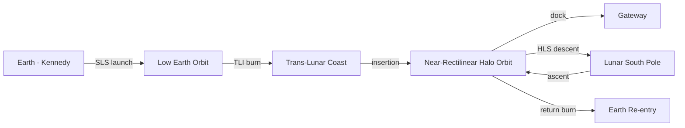

# Artemis: A Technical Primer on the Return to the Moon

> "We go to the Moon not because it is easy, but to learn how to stay."
> — the operating premise of NASA's Artemis program, and the line that separates it
> from Apollo.

Apollo proved humans could reach the Moon and return. **Artemis** is built around a
harder question: can we establish a *sustained* human presence there, and use it as a
proving ground for Mars? This primer walks the architecture end to end — the launch
stack, the trajectory, the orbital mechanics, and the surface objectives.

---

## 1. The program at a glance

Artemis is sequenced as a series of increasingly ambitious missions:

1. **Artemis I** — an uncrewed shakedown. An SLS rocket sent an uncrewed Orion capsule
   on a 25.5-day flight around the Moon and back, splashing down in December 2022.[^a1]
2. **Artemis II** — the first crewed flight: a four-person lunar flyby on a free-return
   trajectory. Targeted for ~~September 2025~~ 2026 after schedule adjustments.
3. **Artemis III** — the first crewed landing since Apollo 17, targeting the lunar
   **south pole** using a commercial Human Landing System (HLS).

The Artemis II crew has been assigned since 2023: Reid Wiseman (commander), Victor Glover
(pilot), Christina Koch (mission specialist), and Jeremy Hansen (mission specialist,
representing the Canadian Space Agency).[^crew]

---

## 2. Why the south pole?

Apollo landed near the equator, in daylight, for operational simplicity. Artemis is going
somewhere far less forgiving — and far more valuable.

- **Water ice.** Permanently shadowed regions (PSRs) inside polar craters have not seen
  sunlight for billions of years. They are cold traps, and they hold water ice.
- **Ice is infrastructure.** Split into hydrogen and oxygen, water becomes breathable air,
  drinking water, and rocket propellant — the difference between visiting and *staying*.
- **Near-continuous power.** Some polar ridges sit in near-permanent sunlight, giving solar
  arrays a duty cycle the equator cannot match.

The trade is brutal terrain, extreme thermal gradients, and long-shadow lighting that makes
landing genuinely hard.

---

## 3. The launch stack: SLS and Orion

The Space Launch System (SLS) Block 1 is the most powerful rocket NASA has flown since the
Saturn V — but the two are not the same machine, and the differences are instructive.

| Parameter            | SLS Block 1        | Saturn V           |
| -------------------- | ------------------ | ------------------ |
| Height               | ~98 m (322 ft)     | ~111 m (363 ft)    |
| Liftoff thrust       | ~39.1 MN           | ~35.1 MN           |
| Payload to TLI[^tli] | ~27 t              | ~48 t              |
| Core stage engines   | 4 × RS-25          | 5 × F-1            |
| Boosters             | 2 × 5-segment solid| none               |
| First flew           | 2022               | 1967               |

SLS actually *out-thrusts* Saturn V at liftoff, yet delivers barely half the payload toward
the Moon. The reason is upper-stage energy: Saturn V's S-IVB was a heavyweight trans-lunar
stage, while Block 1's interim upper stage is comparatively modest. Later SLS variants
(Block 1B, Block 2) close that gap.

The crew rides in **Orion**, a capsule for four, mated to a European Service Module built by
Airbus that provides propulsion, power, and life-support consumables.

---

## 4. Mission architecture

Unlike Apollo's direct lunar-orbit rendezvous, Artemis stages through a **Near-Rectilinear
Halo Orbit (NRHO)** — a highly elliptical, energy-efficient orbit around the Moon that will
eventually host the *Gateway* station.



For Artemis III the crew launches on SLS, transfers to NRHO in Orion, docks with a
pre-positioned HLS, descends to the surface, and later ascends to rejoin Orion for the ride
home. The HLS and its propellant are delivered separately — decoupling the lander from the
crew launch is what makes the architecture scalable.

---

## 5. The mathematics of getting there

Every maneuver above is a change in velocity — a **delta-v** ($\Delta v$) — and each one is
governed by the Tsiolkovsky rocket equation:

$$\Delta v = I_{sp}\, g_0 \ln\!\left(\frac{m_0}{m_f}\right)$$

where $I_{sp}$ is specific impulse (s), $g_0 = 9.807\ \text{m/s}^2$, $m_0$ is the wet mass,
and $m_f$ is the dry mass. The logarithm is the tyranny of the equation: because $\Delta v$
scales with $\ln(m_0/m_f)$, every additional increment of velocity costs *exponentially*
more propellant.

A rough delta-v budget for the outbound journey:

| Maneuver                         | Approx. Δv |
| -------------------------------- | ---------- |
| Surface → Low Earth Orbit        | ~9.4 km/s  |
| LEO → Trans-Lunar Injection      | ~3.1 km/s  |
| Insertion into lunar NRHO        | ~0.4 km/s  |
| NRHO → low lunar orbit → surface | ~2.5 km/s  |

Computing an ideal delta-v is a few lines:

```python
from math import log

def delta_v(isp_seconds: float, wet_mass: float, dry_mass: float, g0: float = 9.80665) -> float:
    """Ideal delta-v (m/s) from the Tsiolkovsky rocket equation."""
    return isp_seconds * g0 * log(wet_mass / dry_mass)

# A cryogenic upper stage (Isp ~ 465 s) burning off 80% of its mass:
print(f"{delta_v(465, m0 := 100, mf := 20):.0f} m/s")  # ≈ 7340 m/s
```

The 20% dry-mass fraction above yields roughly 7.3 km/s from a single stage — which is why
lunar missions *stage*: you throw away empty tankage to keep the mass ratio favorable.

---

## 6. Surface objectives (Artemis III)

The first crewed landing is a demonstration mission, not a full expedition — but its
objectives set the template for everything that follows:

- [x] Land two astronauts safely at the lunar south pole
- [x] Demonstrate the Axiom AxEMU surface suit in a real EVA
- [ ] Collect and characterize samples from a polar region, including possible ice
- [ ] Deploy autonomous science instruments that outlive the crew's stay
- [ ] Validate the NRHO-staged architecture for reuse on Artemis IV+

*(Checked items reflect capabilities already demonstrated on the ground or in prior
missions; unchecked items are first-time surface objectives.)*

---

## 7. Open risks

No honest program overview omits where it might slip:

- **HLS readiness.** The lander is the long pole. Its development pace, not the rocket's,
  is the most likely driver of the landing date.
- **Cryogenic propellant management.** Some architectures require storing and transferring
  cryogenic propellant in space for extended periods — a capability not yet demonstrated at
  operational scale.
- **Suit delivery.** A new surface suit is on the critical path for the first EVA.
- **Cadence.** "Sustained presence" demands roughly annual missions. Apollo proved a sprint;
  Artemis has to prove a rhythm.

---

*Compiled as a PageVault example document.* 🌒 It exercises headings, tables, task lists,
footnotes, math, a mermaid diagram, and a code block — the full markdown feature set — in a
single self-contained file.

[^a1]: Artemis I launched 16 November 2022 and splashed down 11 December 2022 after a flight
of just over 25 days, validating the SLS/Orion stack and Orion's heat shield at lunar-return
velocity (~11 km/s).

[^tli]: **TLI** — Trans-Lunar Injection, the burn that raises an orbit from around Earth onto
a trajectory toward the Moon. "Payload to TLI" is the standard yardstick for lunar-class
launch capability.

[^crew]: Crew assignment announced April 2023. Jeremy Hansen is the first non-American
assigned to a lunar mission, flying under the NASA–CSA partnership.
